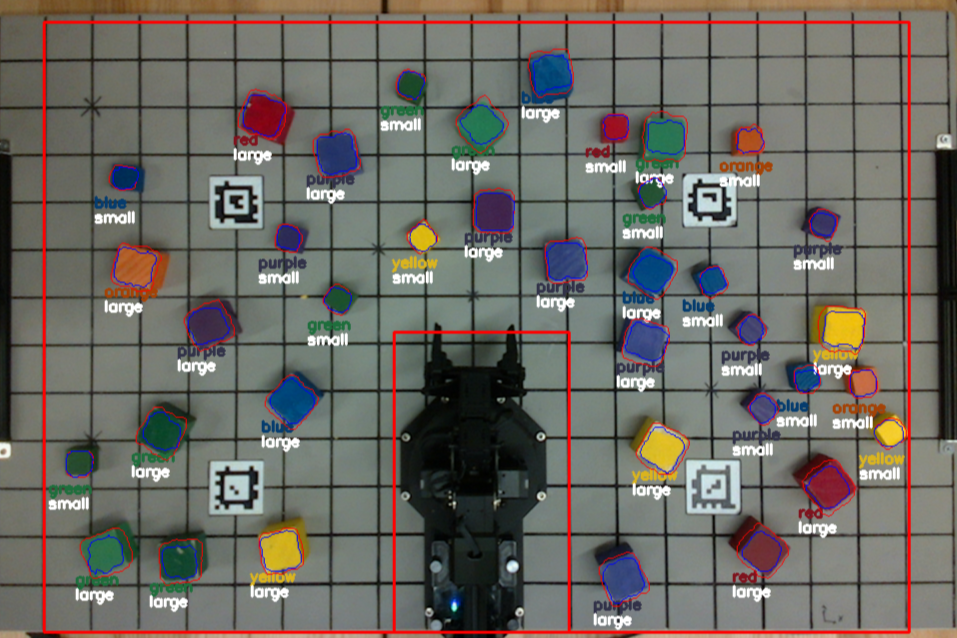
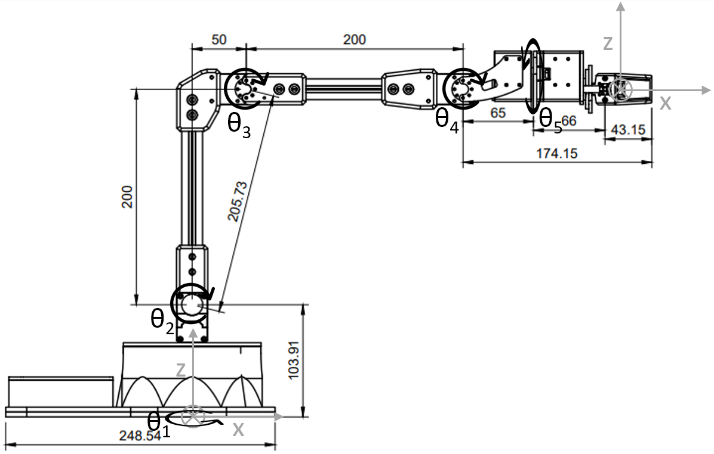

# ROB 550 Armlab

In the Armlab, a 5-DOF robotic arm fully autonomously arranges blocks of different sizes, colors and positions into the desired arrangement. Analytical inverse kinematics is used to determine the appropriate waypoints for our desired end-effector position. A heuristic motion planning method was developed to generate
feasible waypoints. An overhead Intel RealSense LiDAR Camera is utilized to identify blocks on the board. Homogeneous transformations are used to relate pixel and depth coordinates to real-world coordinates. For reliability, the extrinsic matrix is calibrated using four AprilTags with known positions.

https://user-images.githubusercontent.com/44640904/200190783-980dbcec-e18d-4306-8e8d-24b5c22ff71d.mp4

## Hardwares
- Interbotix ReactorX-200 5-DOF Robot Arm
- Intel RealSense LiDAR Camera L515
- ASUS ROG Laptop with Intel i7-10750H CPU

## Sensing

With the given LiDAR camera, we implemented a robust vision system which is capable of autonomous hand-eye calibration with Interbotix ReactorX-200 5-DOF Robot Arm and perform block detection and classification to identify blocks’ locations (2D and 3D coordinates), colors (rainbow colors from red to purple), sizes (large and small) and orientations in real time (25 FPS) with 99.5% color classification accuracy.

## Acting

The forward kinematics is implemented using product of exponential method. The inverse kinematics is then solved analytically by decomposing the
set of joint variables. The path planning generate a list of joint angles for the arm when picking or placing blocks. In the state machine, the logic of the competition events are implemented.

